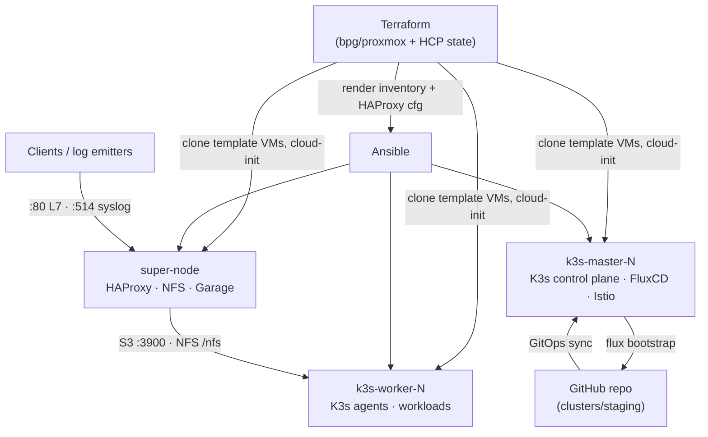

# Infra — K3s Platform on Proxmox


-46489f)

[](LICENSE)

A fully declarative lab platform for Kubernetes on Proxmox. Terraform clones virtual machines from template VMs and renders the Ansible inventory, then Ansible assembles everything on top: a K3s cluster (embedded etcd, HA-capable), Istio service mesh with the Gateway API, HAProxy load balancing and syslog relay, NFS + Garage (S3) storage, and a GitOps control plane bootstrapped with FluxCD from GitHub.

Everything is repeatable from this repository — one `terraform apply` and one script run build the whole platform, and `terraform destroy` tears it down.

## Features

- Provision Proxmox VMs with Terraform (cloned from template VMs, cloud-init configured, SSH-ready gated)
- Scale the cluster by changing node **counts per role** — names, VM IDs, and IPs are generated
- Render the Ansible inventory and HAProxy config directly from Terraform state
- Bootstrap a K3s cluster: first master initializes with embedded etcd, extra masters and workers join with a shared token
- Multi-runtime container support: **crun** as default runtime, **youki** exposed as a `RuntimeClass`
- Istio service mesh (ambient profile) + Kubernetes **Gateway API** for ingress
- HAProxy L7 load balancer (sticky sessions) and syslog relay (TCP + UDP)
- Shared storage tiers: NFS export for shared state, **Garage** for S3-compatible object storage
- GitOps with **FluxCD** bootstrapped from GitHub, with image auto-updating and source watching enabled
- One-command bootstrap (`quickstart.sh`) with per-playbook timing and logs
- Secrets stay out of git: Terraform reads `*.tfvars`, Ansible reads environment variables

## Architecture



### Node roles

| Role | Runs | Default spec |
|---|---|---|
| `super-node` | HAProxy (L7 LB + syslog relay), NFS server, Garage (S3) | 1 vCPU, 2 GB RAM, 32 GB + 100 GB disks |
| `k3s-master` | K3s control plane (embedded etcd), FluxCD, Istio control plane | 2 vCPU, 8 GB RAM, 32 GB disk |
| `k3s-worker` | K3s agents, workload pods | 2 vCPU, 8 GB RAM, 32 GB disk |

### Default nodes (one per role)

| Name | VM ID | IP | Cloned from |
|---|---|---|---|
| `super-node-1` | 200 | 10.10.16.4 | template 2000 |
| `k3s-master-1` | 210 | 10.10.16.11 | template 4000 |
| `k3s-worker-1` | 220 | 10.10.16.21 | template 3000 |

### Scaling

Set `var.cluster_node_counts` (e.g. `{ super = 1, master = 3, worker = 3 }`) and per-role sizing in `var.cluster_node_specs`. Node *N* (1-based) of a role gets name `<name_base>-N`, VM ID `<vm_id_base> + (N-1)`, and IP `<ip_base> + (N-1)` in `var.cluster_subnet`. Terraform fails early if two roles' IP ranges would overlap.

## Architecture Decisions

| # | Decision | Why |
|---|---|---|
| 1 | K3s instead of full Kubernetes | Single binary, low memory, built-in etcd, works with Helm and the Gateway API. |
| 2 | HA via embedded etcd | No separate database. First master initializes; the rest join with a shared token. |
| 3 | One "super-node" for LB + NFS + S3 | Limited lab VMs — edge services share one VM to save RAM and disks. |
| 4 | Terraform owns VMs, Ansible owns software | Clean split: Terraform manages infrastructure state, Ansible manages software state. |
| 5 | Count-based node generation | Change a few numbers to scale; names, VM IDs, IPs, and the inventory are all derived. |
| 6 | Clone from template VMs | Fast and consistent provisioning; cloud-init only sets hostname, user, SSH keys, and IP. |
| 7 | Terraform renders the Ansible inventory + HAProxy config | No manual drift between topology and config — both come from the same variables. |
| 8 | Disable Traefik and K3s local storage | Ingress is handled by Gateway API/Istio, storage by NFS/Garage — no redundant components. |
| 9 | crun default + youki RuntimeClass | Experiment with alternative OCI runtimes from plain Kubernetes `runtimeClassName`. |
| 10 | Istio **ambient** + Gateway API | Lightweight mesh with mTLS and a standards-based ingress API instead of sidecars everywhere. |
| 11 | Two storage tiers: NFS + Garage | NFS for shared file state, Garage for S3 objects — both live on the data-heavy super-node. |
| 12 | GitOps with FluxCD | `flux bootstrap github` binds the cluster to a repo; extra components (image-reflector, image-automation, source-watcher) enable automatic image updates. |
| 13 | Secrets outside git | Terraform reads `secrets.auto.tfvars` (gitignored); Ansible reads env vars (`APP_GIT_SECRET`, Garage keys). |
| 14 | Syslog fan-out through HAProxy | One entry point (`:514` TCP/UDP) balanced across all K8s nodes (`:30514`) for centralized log shipping. |

## Tech Stack

| Category | Tools |
|---|---|
| Infrastructure | Proxmox VE, Terraform (`bpg/proxmox` 0.111.1, HCP remote state), Ansible |
| Kubernetes | K3s (embedded etcd), Istio 1.30 (ambient), Gateway API v1.6 (experimental) |
| Container runtimes | crun (default), youki 0.7 (`RuntimeClass`) |
| Edge / logging | HAProxy (L7 LB, stats, syslog relay) |
| Storage | nfs-kernel-server, Garage 2.3.0 (S3-compatible) |
| GitOps | FluxCD (bootstrapped from GitHub) |

## Repository Structure

```text
.
├── ansible/
│   ├── ansible.cfg                        # python3.13, pipelining, roles path
│   ├── inventory/hosts                    # rendered by Terraform (hosts.tpl)
│   ├── logs/                              # quickstart.sh bootstrap logs
│   ├── playbooks/
│   │   ├── 00-prerequisites.yml           # disable IPv6 on all nodes
│   │   ├── 01-cluster-setup.yml           # HAProxy, K3s cluster, youki/crun, kubeconfig
│   │   ├── 02-servicemesh.yml             # Istio ambient + Gateway API
│   │   ├── 03-storage-networking.yml      # NFS server on the super-node
│   │   ├── 04-garage-deploy.yml           # Garage S3 on the super-node
│   │   ├── 05-gitops-bootstrap.yml        # FluxCD bootstrap from GitHub
│   │   ├── quickstart.sh                  # runs all playbooks in order
│   │   └── files/                         # fetched kubeconfig (k3s-kubeconfig.yaml)
│   └── roles/
│       ├── common/                        # base packages, qemu-guest-agent
│       ├── fluxcd/                        # Flux CLI + GitHub bootstrap
│       ├── garage/                        # Garage binary, config, systemd unit
│       ├── istio/                         # istioctl, ambient profile, Gateway API
│       ├── k3s-agent/                     # join workers
│       ├── k3s-server/                    # initialize / join masters
│       ├── load-balance/                  # HAProxy install + config
│       ├── nfs/                           # disk prep, exports, nfs-kernel-server
│       └── runtime/                       # youki + crun + containerd config
├── terraform/
│   ├── backend.tf                         # HCP Terraform (org: traipoap, workspace: proxmox)
│   ├── provider.tf                        # bpg/proxmox (SSH agent mode)
│   ├── variables.tf                       # networking + per-role node specs
│   ├── locals.tf                          # generates names/VM IDs/IPs from counts
│   ├── main.tf                            # clone VMs, cloud-init, wait for SSH, render files
│   ├── secrets.auto.tfvars                # gitignored — password + SSH keys
│   └── templates/
│       ├── hosts.tpl                      # → ansible/inventory/hosts
│       └── haproxy.tpl                    # → ansible/roles/load-balance/templates/haproxy.cfg.j2
├── LICENSE
└── README.md
```

## Quickstart

### Prerequisites

- A Proxmox VE host with:
  - Template VMs available for cloning: **2000** (super-node), **4000** (master), **3000** (worker) — or adjust `cluster_node_specs.*.clone_vm_id`
  - A bridge (default `vmbr16`) on the cluster subnet (default `10.10.16.0/24`, gateway `10.10.16.1`)
  - Datastores used in the default specs: `data-st1000`, `system-hs512`, `st500`
- A Proxmox user with API access
- Terraform CLI and an HCP Terraform account (backend: org `traipoap`, workspace `proxmox`) — or switch `backend.tf` to a local backend
- Ansible on the control machine, and key-based SSH access to the VMs (the cloud-init snippet injects your keys)
- A GitHub repository for Flux (default: `traipoap/gitops`) and a personal access token with **read/write contents** permission (Flux bootstraps with `--read-write-key`)

### 1. Clone the repository

```bash
git clone <this-repo> && cd infra
```

### 2. Configure Terraform

Create `terraform/secrets.auto.tfvars` (gitignored):

```hcl
proxmox_password = "CHANGE_ME"
ssh_public_keys  = ["ssh-ed25519 AAAA... you@example.com"]
```

Anything else (endpoint, usernames, node counts, specs, networking) is a regular variable with defaults in `variables.tf` — override via `terraform.tfvars` or `-var` as needed. Key variables:

| Variable | Default | Purpose |
|---|---|---|
| `proxmox_endpoint` | `https://proxmox.example.com` | Proxmox API endpoint |
| `proxmox_username` / `proxmox_ssh_username` | `example@pam` / `example` | API and SSH usernames |
| `ssh_username` | `example` | User created on every VM via cloud-init |
| `network_bridge` / `cluster_subnet` / `gateway_ip` | `vmbr16` / `10.10.16.0/24` / `10.10.16.1` | VM networking |
| `cluster_node_counts` | `{ super = 1, master = 1, worker = 1 }` | How many VMs per role |
| `cluster_node_specs` | see `variables.tf` | vCPU, RAM, disks, name/VM-ID/IP bases per role |
| `timezone` | `Asia/Bangkok` | Set on every VM |

### 3. Provision the VMs

```bash
cd terraform
terraform login
terraform apply
```

Terraform will:

1. Generate per-VM cloud-init snippets (hostname, user, SSH keys, static IP)
2. Clone and configure the VMs (CPU, RAM, disks, bridge), then **block until every node is SSH-ready**
3. Render `../ansible/inventory/hosts` and the HAProxy config from the same node list

### 4. Run the Ansible playbooks

From the `ansible/` directory, set the required secret and optionally the Garage credentials:

```bash
cd ../ansible
export APP_GIT_SECRET="ghp_..."        # required for 05-gitops-bootstrap
# optional — auto-generated with secure defaults if unset:
export RPC_SECRET="$(openssl rand -hex 32)"
export ADMIN_TOKEN="$(openssl rand -A 64)"
export GARAGE_DEFAULT_ACCESS_KEY="GK$(openssl rand -hex 16)"
export GARAGE_DEFAULT_SECRET_KEY="$(openssl rand -hex 32)"

./playbooks/quickstart.sh
```

`quickstart.sh` runs the six playbooks in order (with a 15 s pause between them), stops on the first failure, and tees everything to `ansible/logs/bootstrap-<timestamp>.log`:

| Playbook | What it does |
|---|---|
| `00-prerequisites` | Disables IPv6 on all nodes |
| `01-cluster-setup` | Installs HAProxy on the super-node; installs K3s on the first master (`--cluster-init`, traefik/local-storage disabled), joins extra masters serially, joins workers; installs youki + crun runtimes; fetches the kubeconfig to `~/.kube/config` (server rewritten to the master IP) |
| `02-servicemesh` | Installs Istio (ambient profile, CNI dirs tuned for K3s) and the Gateway API CRDs |
| `03-storage-networking` | Finds the ~100 GB disk, formats ext4, mounts `/nfs`, exports it, runs nfs-kernel-server |
| `04-garage-deploy` | Installs Garage 2.3.0 (single-node) on the super-node with a hardened systemd unit; data on `/nfs/data` |
| `05-gitops-bootstrap` | Installs the Flux CLI and runs `flux bootstrap github` (owner `traipoap`, repo `gitops`, branch `main`, path `./clusters/staging`, `--read-write-key --personal`, plus image-reflector/image-automation/source-watcher components) |

You can also run any playbook individually:

```bash
ansible-playbook -i inventory/hosts playbooks/02-servicemesh.yml
```

### 5. Verify

```bash
kubectl get nodes -o wide          # master + workers Ready
kubectl get runtimeclass           # "youki" present
curl -s http://10.10.16.4:8080     # HAProxy stats (admin:securepass)
mc alias set garage http://10.10.16.4:3900 \
  $GARAGE_DEFAULT_ACCESS_KEY $GARAGE_DEFAULT_SECRET_KEY   # Garage S3, see Storage section
ssh traipoap@10.10.16.11 'flux get sources -A'            # Flux watching the repo
```

### Environment variables consumed by Ansible

| Variable | Required | If unset |
|---|---|---|
| `APP_GIT_SECRET` | Yes (playbook 05) | — |
| `RPC_SECRET` | No | auto-generated (64 hex) |
| `ADMIN_TOKEN` | No | auto-generated (64 alphanumeric) |
| `GARAGE_DEFAULT_ACCESS_KEY` | No | auto-generated (`GK` + 32 hex) |
| `GARAGE_DEFAULT_SECRET_KEY` | No | auto-generated (64 hex) |

## GitOps Workflow

Playbook `05-gitops-bootstrap` runs on the first master:

```bash
flux bootstrap github \
  --components-extra=image-reflector-controller,image-automation-controller,source-watcher \
  --owner=traipoap --repository=gitops --branch=main \
  --path=./clusters/staging --read-write-key --personal
```

- Flux provisions itself in the cluster and creates a GitHub App / PAT to sync `traipoap/gitops`
- The watched path is `./clusters/staging` on branch `main` — commit Kubernetes manifests, Kustomizations, HelmReleases, ImagePolicies there and the cluster follows
- `--read-write-key` lets Flux push back (e.g. Flux-generated resources)
- The extra controllers enable **automatic image tag updates** (ImageReflectionController + ImageAutomationController) and non-K8s source watching
- Override `github_owner` / `github_repo` / `cluster_name` in `playbooks/05-gitops-bootstrap.yml` for your own repository

## Storage

### NFS (super-node)

- The ~100 GB data disk is auto-detected by size, partitioned, formatted ext4, and mounted at `/nfs`
- Export (from `/etc/exports`): `/nfs *(rw,sync,no_subtree_check,all_squash,anonuid=0,anongid=0)`
- Intended for shared file state and as the backing volume for Garage

### Garage (super-node, S3-compatible)

Single-node Garage 2.3.0 running under a hardened systemd unit (`ProtectSystem=strict`, `NoNewPrivileges`, private tmp):

| Endpoint | Bind | Purpose |
|---|---|---|
| S3 API | `:3900` | region `garage`, root domain `*.s3.garage.localhost` |
| Web | `:3902` | root domain `*.web.garage.localhost` |
| Admin | `[::1]:3903` | loopback only — token-protected, never exposed |

- Data: `/nfs/data` (the NFS disk), metadata: `/var/lib/garage`
- A `default-bucket` is created at first start from `GARAGE_DEFAULT_ACCESS_KEY` / `GARAGE_DEFAULT_SECRET_KEY`
- Config lives in `/etc/garage.toml`; credentials are written into the systemd unit environment

## Load Balancing & Logging (super-node)

HAProxy (config rendered by Terraform from `templates/haproxy.tpl`):

- **`:80`** — L7 HTTP load balancing across master + worker nodes, `balance source` with `JSESSIONID` cookie stickiness
- **`:8080`** — stats page (`stats auth admin:securepass`)
- **`:514` TCP + UDP** — syslog relay fan-out to every K8s node on `:30514` (UDP via `log-forward`)

## Service Ports

| Service | Node(s) | Port(s) |
|---|---|---|
| K3s API | masters | 6443 |
| HAProxy L7 LB / stats | super-node | 80 / 8080 |
| Syslog relay (in) / receivers (out) | super-node / all K8s nodes | 514 → 30514 |
| NFS | super-node | 2049 |
| Garage S3 / Web / Admin | super-node | 3900 / 3902 / 3903 (loopback) |

## Security

- Secrets never land in git: `secrets.auto.tfvars` is gitignored, `*.tfvars` excluded, Ansible reads env vars
- Garage admin API is bound to loopback only; the systemd unit is sandboxed
- IPv6 disabled across the lab, TLS 1.2+ enforced on HAProxy
- Flux runs with a narrowly-scoped GitHub token (`--personal --read-write-key` on one repo)

> This is a lab platform. For production: move the HAProxy stats credentials and `admin:securepass` out of the templates, restrict the NFS export to the cluster subnet, and terminate TLS at the edge.

## Destroying the Cluster

```bash
cd terraform
terraform destroy
```

This removes the cloned VMs and cloud-init snippets. The template VMs, the GitHub Flux repository, and the local `~/.kube/config` are left in place.

## Troubleshooting

- **Terraform hangs in "Waiting for VMs to be SSH ready"** — the VM booted but the cloud-init SSH key didn't land. Check the VM's serial console; verify `ssh_public_keys` in `secrets.auto.tfvars` and the template VM's cloud-init support.
- **`flux bootstrap github` fails in playbook 05** — `APP_GIT_SECRET` must be a PAT with read/write contents on the target repo; `ignore_errors: true` masks this, check the play log for the underlying error.
- **Worker won't join** — playbook 01 prints the exact cause. Verify the worker can reach the first master on `:6443` and that the master token (`/var/rancher/k3s/server/node-token` on the master) is readable.
- **`kubectl` not working locally** — playbook 01 copies the (rewritten) kubeconfig to `~/.kube/config`; re-run the last play or fetch `/etc/rancher/k3s/k3s.yaml` from the master manually.
- **Garage credentials** — if auto-generated, the masked values appear in the playbook 04 log, the full values are in `/etc/garage.toml` and the systemd unit on the super-node.
- **HAProxy shows no backends** — confirm `ansible/inventory/hosts` and `roles/load-balance/templates/haproxy.cfg.j2` were rendered by the latest `terraform apply` (both are generated files).
- **Ansible logs** — every `quickstart.sh` run is captured in `ansible/logs/bootstrap-<timestamp>.log`.

## Contributing

Contributions are welcome!

- Open an issue for bugs or ideas
- Submit a pull request for improvements

Please keep changes consistent with the existing style (Apache-2.0 headers on new files) and update the documentation.

## License

This project is licensed under the Apache 2.0 license — see the [LICENSE](LICENSE) file.
