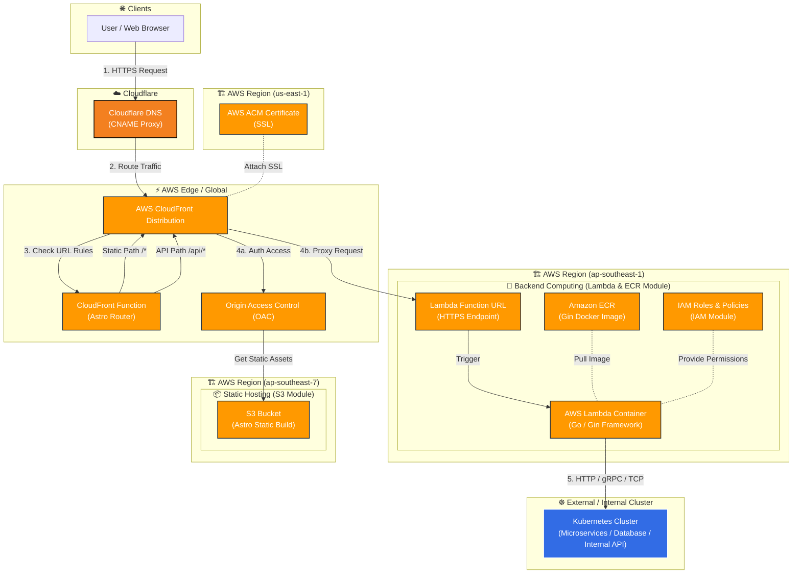

```mermaid
flowchart TB
    subgraph CLIENT ["🌐 Clients"]
        User["User / Web Browser"]
    end

    subgraph DNS_LAYER ["☁️ Cloudflare"]
        CF_DNS["Cloudflare DNS<br/>(CNAME Proxy)"]
    end

    subgraph AWS_EDGE ["⚡ AWS Edge / Global"]
        CF_DIST["AWS CloudFront Distribution"]
        CFF["CloudFront Function<br/>(Astro Router)"]
        OAC["Origin Access Control (OAC)"]
    end

    subgraph AWS_REGION ["🏗️ AWS Region (ap-southeast-1)"]
        subgraph BACKEND ["🚀 Backend Computing (Lambda & ECR Module)"]
            ECR["Amazon ECR<br/>(Gin Docker Image)"]
            IAM["IAM Roles & Policies<br/>(IAM Module)"]
            LURL["Lambda Function URL<br/>(HTTPS Endpoint)"]
            LAMBDA["AWS Lambda Container<br/>(Go / Gin Framework)"]
        end
    end

    subgraph K8S_LAYER ["☸️ External / Internal Cluster"]
        K8S["Kubernetes Cluster<br/>(Microservices / Database / Internal API)"]
    end

    subgraph AWS_REGION_TH ["🏗️ AWS Region (ap-southeast-7)"]
        subgraph FRONTEND ["📦 Static Hosting (S3 Module)"]
            S3["S3 Bucket<br/>(Astro Static Build)"]
        end
    end

    subgraph AWS_REGION_US ["🏗️ AWS Region (us-east-1)"]
        subgraph ACM["AWS ACM Certificate<br/>(SSL)"]
        end
    end
        
    %% Flow Connections
    User -->|1. HTTPS Request| CF_DNS
    CF_DNS -->|2. Route Traffic| CF_DIST
    ACM -.-|Attach SSL| CF_DIST
    
    %% CloudFront Processing & Routing
    CF_DIST -->|3. Check URL Rules| CFF
    
    %% Static Route
    CFF -->|Static Path /*| CF_DIST
    CF_DIST -->|4a. Auth Access| OAC
    OAC -->|Get Static Assets| S3

    %% API Route
    CFF -->|API Path /api/*| CF_DIST
    CF_DIST -->|4b. Proxy Request| LURL
    LURL -->|Trigger| LAMBDA

    %% AWS Internal Dependencies
    ECR -.-|Pull Image| LAMBDA
    IAM -.-|Provide Permissions| LAMBDA

    %% Backend to K8s Connection
    LAMBDA -->|5. HTTP / gRPC / TCP| K8S

    %% Class Styling
    classDef aws fill:#FF9900,stroke:#232F3E,stroke-width:1.5px,color:#FFFFFF;
    classDef cf fill:#F38020,stroke:#000,stroke-width:1.5px,color:#FFFFFF;
    classDef k8s fill:#326CE5,stroke:#fff,stroke-width:1.5px,color:#FFFFFF;
    
    class ACM,CF_DIST,CFF,OAC,S3,ECR,IAM,LAMBDA,LURL aws;
    class CF_DNS cf;
    class K8S k8s;
```
