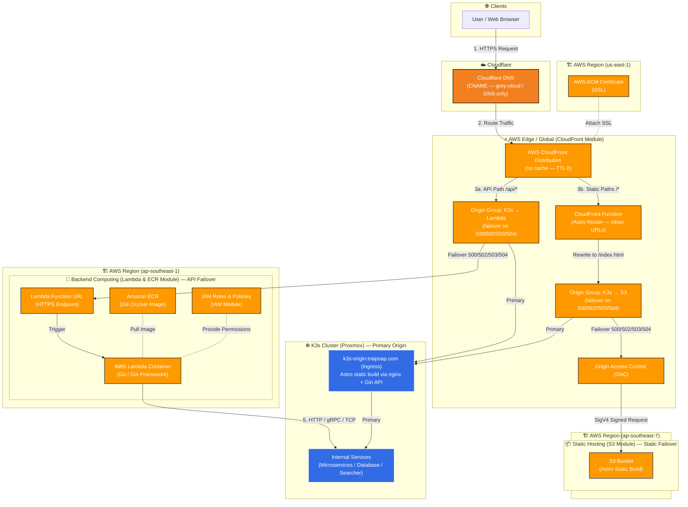
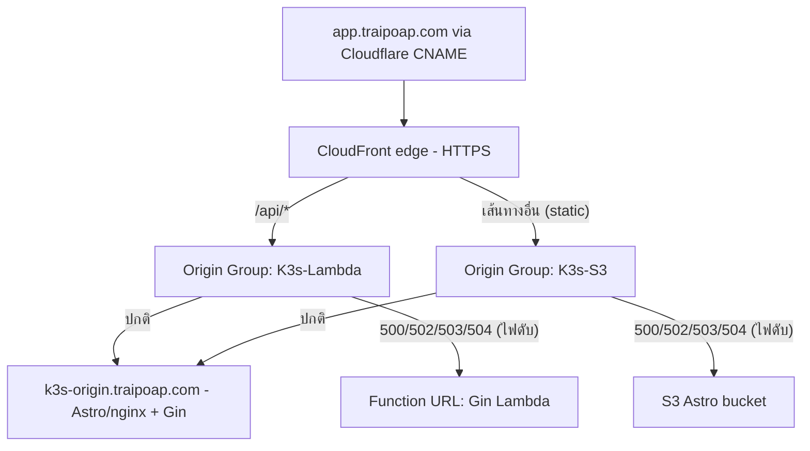

```mermaid
flowchart TB
    subgraph CLIENT ["🌐 Clients"]
        User["User / Web Browser"]
    end

    subgraph DNS_LAYER ["☁️ Cloudflare"]
        CF_DNS["Cloudflare DNS<br/>(CNAME — grey-cloud / DNS-only)"]
    end

    subgraph AWS_EDGE ["⚡ AWS Edge / Global (CloudFront Module)"]
        CF_DIST["AWS CloudFront Distribution<br/>(no cache — TTL 0)"]
        CFF["CloudFront Function<br/>(Astro Router — clean URLs)"]
        OG_API["Origin Group: K3s → Lambda<br/>(failover on 500/502/503/504)"]
        OG_STATIC["Origin Group: K3s → S3<br/>(failover on 500/502/503/504)"]
        OAC["Origin Access Control (OAC)"]
    end

    subgraph K8S_LAYER ["☸️ K3s Cluster (Proxmox) — Primary Origin"]
        K3S_ORIGIN["k3s-origin.traipoap.com (Ingress)<br/>Astro static build via nginx + Gin API"]
        K8S_INT["Internal Services<br/>(Microservices / Database / Searcher)"]
    end

    subgraph AWS_REGION ["🏗️ AWS Region (ap-southeast-1)"]
        subgraph BACKEND ["🚀 Backend Computing (Lambda & ECR Module) — API Failover"]
            ECR["Amazon ECR<br/>(Gin Docker Image)"]
            IAM["IAM Roles & Policies<br/>(IAM Module)"]
            LURL["Lambda Function URL<br/>(HTTPS Endpoint)"]
            LAMBDA["AWS Lambda Container<br/>(Go / Gin Framework)"]
        end
    end

    subgraph AWS_REGION_TH ["🏗️ AWS Region (ap-southeast-7)"]
        subgraph FRONTEND ["📦 Static Hosting (S3 Module) — Static Failover"]
            S3["S3 Bucket<br/>(Astro Static Build)"]
        end
    end

    subgraph AWS_REGION_US ["🏗️ AWS Region (us-east-1)"]
        subgraph ACM["AWS ACM Certificate<br/>(SSL)"]
        end
    end

    %% Flow Connections
    User -->|1. HTTPS Request| CF_DNS
    CF_DNS -->|2. Route Traffic| CF_DIST
    ACM -.-|Attach SSL| CF_DIST

    %% CloudFront Processing & Routing
    CF_DIST -->|3a. API Path /api/*| OG_API
    CF_DIST -->|3b. Static Paths /*| CFF
    CFF -->|Rewrite to /index.html| OG_STATIC

    %% API Route: K3s primary, Lambda failover
    OG_API -->|Primary| K3S_ORIGIN
    OG_API --"Failover 500/502/503/504"--> LURL
    LURL -->|Trigger| LAMBDA

    %% Static Route: K3s primary, S3 failover
    OG_STATIC -->|Primary| K3S_ORIGIN
    OG_STATIC --"Failover 500/502/503/504"--> OAC
    OAC -->|SigV4 Signed Request| S3

    %% AWS Internal Dependencies
    ECR -.-|Pull Image| LAMBDA
    IAM -.-|Provide Permissions| LAMBDA

    %% Backend to K8s Connection
    LAMBDA -->|5. HTTP / gRPC / TCP| K8S_INT
    K3S_ORIGIN --> |Primary| K8S_INT

    %% Class Styling
    classDef aws fill:#FF9900,stroke:#232F3E,stroke-width:1.5px,color:#FFFFFF;
    classDef cf fill:#F38020,stroke:#000,stroke-width:1.5px,color:#FFFFFF;
    classDef k8s fill:#326CE5,stroke:#fff,stroke-width:1.5px,color:#FFFFFF;

    class ACM,CF_DIST,CFF,OAC,OG_API,OG_STATIC,S3,ECR,IAM,LAMBDA,LURL aws;
    class CF_DNS cf;
    class K3S_ORIGIN,K8S_INT k8s;
```

```mermaid
flowchart TD
    A[app.traipoap.com via Cloudflare CNAME] --> B[CloudFront edge - HTTPS]
    B -- "/api/*" --> G1[Origin Group: K3s-Lambda]
    B -- "เส้นทางอื่น (static)" --> G2[Origin Group: K3s-S3]
    G1 -->|ปกติ| K3S[k3s-origin.traipoap.com - Astro/nginx + Gin]
    G1 -- "500/502/503/504 (ไฟดับ)" --> L[Function URL: Gin Lambda]
    G2 -->|ปกติ| K3S
    G2 -- "500/502/503/504 (ไฟดับ)" --> S3[S3 Astro bucket]
```
