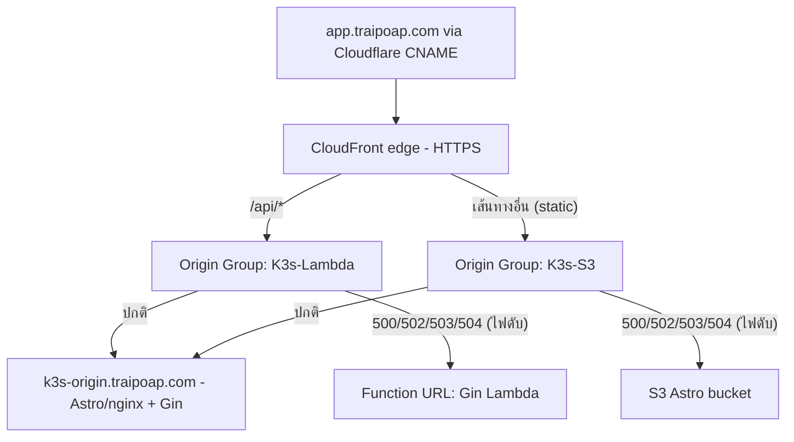

```mermaid
flowchart TD
    A[app.traipoap.com via Cloudflare CNAME] --> B[CloudFront edge - HTTPS]
    B -- "/api/*" --> G1[Origin Group: K3s-Lambda]
    B -- "เส้นทางอื่น (static)" --> G2[Origin Group: K3s-S3]
    G1 -->|ปกติ| K3S[k3s-origin.traipoap.com - Astro/nginx + Gin]
    G1 -- "500/502/503/504 (ไฟดับ)" --> L[Function URL: Gin Lambda]
    G2 -->|ปกติ| K3S
    G2 -- "500/502/503/504 (ไฟดับ)" --> S3[S3 Astro bucket]
```
